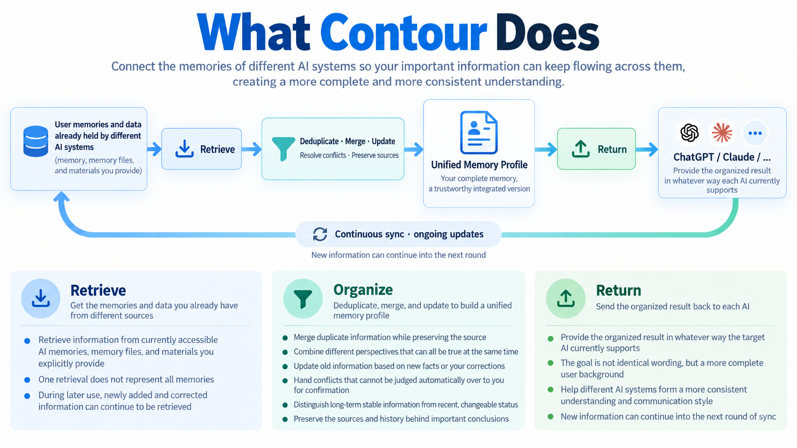
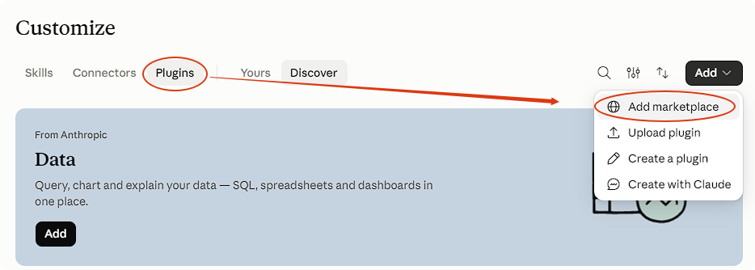
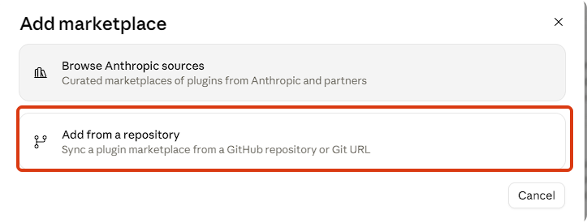
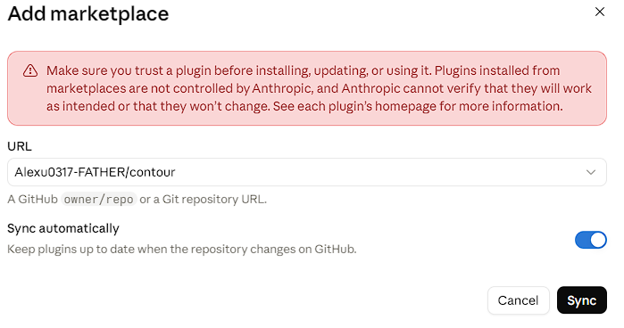
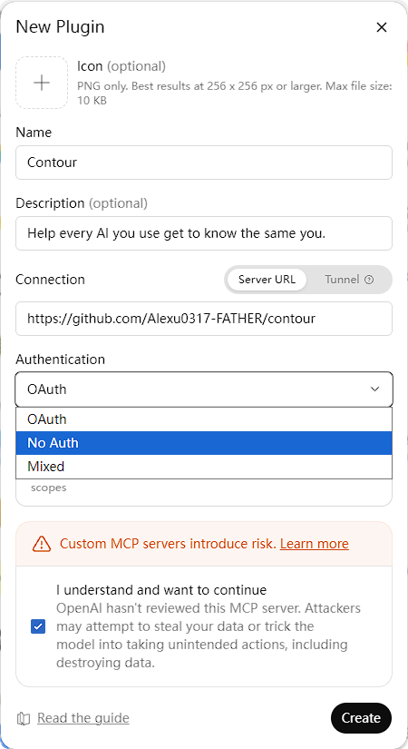

# Contour 知界

English | [中文](README.zh.md)

> Help every AI you use get to know the same you.

Maybe you use a web AI and a local one side by side, such as ChatGPT and Codex, for different jobs or just to make the most of each one's usage limits. Sooner or later the threads cross: you mention to Codex some research you did in ChatGPT, and Codex has no memory of it.

Or you can't remember whether it was ChatGPT or Claude that helped you write an article a few months ago, so you end up searching both.

Or you want Claude to write a landing page for your project, because Claude knows your writing style, but all the project background and discussion lives in Codex. Now you spend extra usage explaining to Claude everything that never made it into GitHub.

If you use more than one AI, each of them knows part of you, and every time you switch you have to explain yourself again.

**Contour links the memories scattered across your AIs, a little more with each sync.**

It collects what each AI can currently share about you, plus any material you provide, organizes it into one archive that you control, and hands the relevant parts to your other AIs.



The more you use it, the more your AIs' understanding of you converges, instead of each one knowing a different you.

## Features

- **You stay in control of your personal data.** Contour only draws the boundaries around your memories. Keep your archive wherever you like: a local folder, Dropbox, Google Drive, Notion… as long as your AIs have a way to read and write it.
- **No setup marathon.** Getting started doesn't mean answering round after round of questions. Contour lets the AI do the work for you.
- **Built on each AI's own memory.** Anthropic, OpenAI and Google keep improving how their assistants store and recall memories. Contour works with those mechanisms and simply brings a fuller picture of you into each one.

> Contour doesn't require every AI to store identical memories. What matters is whether the AI you switch to still understands the background, preferences and communication style that are relevant to what you're asking.

## Installation

Install Contour in each AI you want to share your memory.

### Claude web (claude.ai) / Claude Desktop

1. Open **Customize → Plugins** and click **Add → Add marketplace** in the top right.
2. Choose **Add from a repository**, enter `Alexu0317-FATHER/contour` as the URL, and click **Sync**. Keep **Sync automatically** on so Contour stays up to date.
3. Once it has synced, find **contour** under **Plugins** and install it.







### Claude Code

```text
/plugin marketplace add Alexu0317-FATHER/contour
/plugin install contour@contour
```

When asked for an installation scope, choose **user scope** so it works in every project. After installing, reload plugins when prompted or start a new session.

### Codex

```text
codex plugin marketplace add Alexu0317-FATHER/contour
codex plugin add contour@contour
```

Start a new session after installing.

### ChatGPT web

Skills uploaded from your computer are snapshots and do not update with the repository. Instead, open **Plugins** in the ChatGPT sidebar, click **+** in the top-right corner to open **New Plugin**, complete the following fields, select **I understand and want to continue** in the risk notice, then click **Create**.

- **Name:** Contour
- **Description (optional):** Help every AI you use get to know the same you.
- **Connection:** Select **Server URL** and enter `https://github.com/Alexu0317-FATHER/contour`
- **Authentication:** Select **No Auth**



### Let the AI install it

Claude Code and Codex can run the install commands themselves. Just send:

```text
Install this plugin for me: https://github.com/Alexu0317-FATHER/contour
```

## Getting started

Contour needs memories from at least two different AIs before it builds your first archive, so getting started takes three steps:

1. **In your first AI, say:**

   ```text
   Help me get started with Contour.
   ```

   It first asks where to keep your archive and checks that this AI can read and write there. If it can't connect, it tells you what's missing. Once the location is set, it asks which other AIs you use and what it may read, then collects what this AI remembers about you.

2. **Switch to your second AI and say:**

   ```text
   Add this AI to my existing Contour archive.
   ```

   It asks where the archive is, tells you which AIs are already connected, collects what this AI remembers about you, and organizes both into the first version of your archive.

3. **Go back to your first AI and say "Sync Contour"** so it reads the new archive.

To add another AI later, install the plugin there and repeat step 2.

- If you already have a bio, a profile file or a memory export, hand it over in step 1. Contour compares it with what your AIs remember, but it can't stand in for a second AI.
- If you've only done step 1, Contour saves what it collected and builds the archive once a second AI joins.

### Calling Contour by name

If the AI doesn't pick up Contour on its own, call it directly:

| | Claude (web / Desktop / Claude Code) | Codex | ChatGPT |
|---|---|---|---|
| Contour (anything) | `/contour` | `$contour` | Type `@` and pick contour |
| Sync | `/contour-sync` | `$contour-sync` | Type `@`, pick contour, then write "sync" |
| Status | `/contour-status` | `$contour-status` | Type `@`, pick contour, then write "status" |

You can add a sentence after the command, for example `/contour This is out of date, stop using it`.

## Everyday use

### Sync

```text
Sync Contour
```

Whichever AI you say this in hands over what it has recently learned or corrected about you, then reads back the latest archive. Your other AIs don't need to be open; next time you use one, say it there too. The first collection may not capture everything, and each sync fills in more.

For now, you start each sync yourself. If an AI notices something worth remembering while working on another task, it may ask whether to sync once the task is done.

After each sync, Contour reports the results in tables, for example:

**Added to your archive**

| From | What |
|---|---|
| Claude Code | Started new project X, aiming to launch in October |
| Claude Code | Correction: 6 years of work experience, not 5 |
| ChatGPT web | Not collected: the connection expired and needs reconnecting |

**Needs your input**

| From | Issue | What you need to do |
|---|---|---|
| Claude Code / ChatGPT web | One says you live in Shanghai, the other Hangzhou, and it's unclear which is newer | Tell me which one is right |

When two AIs disagree and it's unclear which is newer, Contour won't pick for you. The report also lists which AIs have read the new archive and which haven't.

### Check status and pick up where you left off

```text
Show my Contour status
```

This only reads the records and doesn't change your archive. If the last sync stopped halfway, for example because a connection dropped, say "Continue the unfinished sync". It picks up where it stopped without reprocessing anything already done.

### Correct or retract

Tell the AI what's wrong or what should go:

```text
Part of the work history I gave earlier was wrong. Use what I just said instead and update Contour.
```

```text
When we discuss plans, point out the assumptions that affect the decision before making suggestions. Save this preference to Contour.
```

```text
This is out of date. Tell Contour to stop using it.
```

A correction marks the old entry as superseded, so the history stays traceable. After a retraction, Contour stops using that entry in your archive and tells you where it may still remain: in the original records, in older versions of the archive, and in each AI's own memory.

### Check whether your AIs understand you the same way

```text
My AIs seem to understand me differently. Can you check?
```

Contour runs the same set of scenario questions on each AI and compares their answers. A completed sync only means every AI received the same archive; this check shows whether they actually understand you accordingly.

## Troubleshooting

If Contour itself goes wrong, for example a step can't be completed as described, the AI first tells you what was done and what wasn't, then drafts an issue report with personal content removed and asks whether to submit it. You can also report problems directly in [Issues](https://github.com/Alexu0317-FATHER/contour/issues). Please don't paste memory content or personal information.

## Privacy

- Contour has no server of its own and collects no data. Your archive lives only in the location you choose.
- Contour asks for your consent before reading any AI's memory or writing your archive anywhere, and asks again before going beyond what you agreed to.
- When an AI reads your memories or archive, that content passes through the AI service you're using and is handled under its own privacy policy.
- Contour never asks for passwords, cookies or other login credentials.
- Issue reports drafted after an error have personal content removed and are only submitted to the public GitHub Issues with your consent.

See also the [Terms of Use](TERMS.md).

## License

MIT, see [LICENSE](LICENSE).
