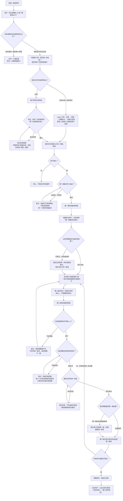
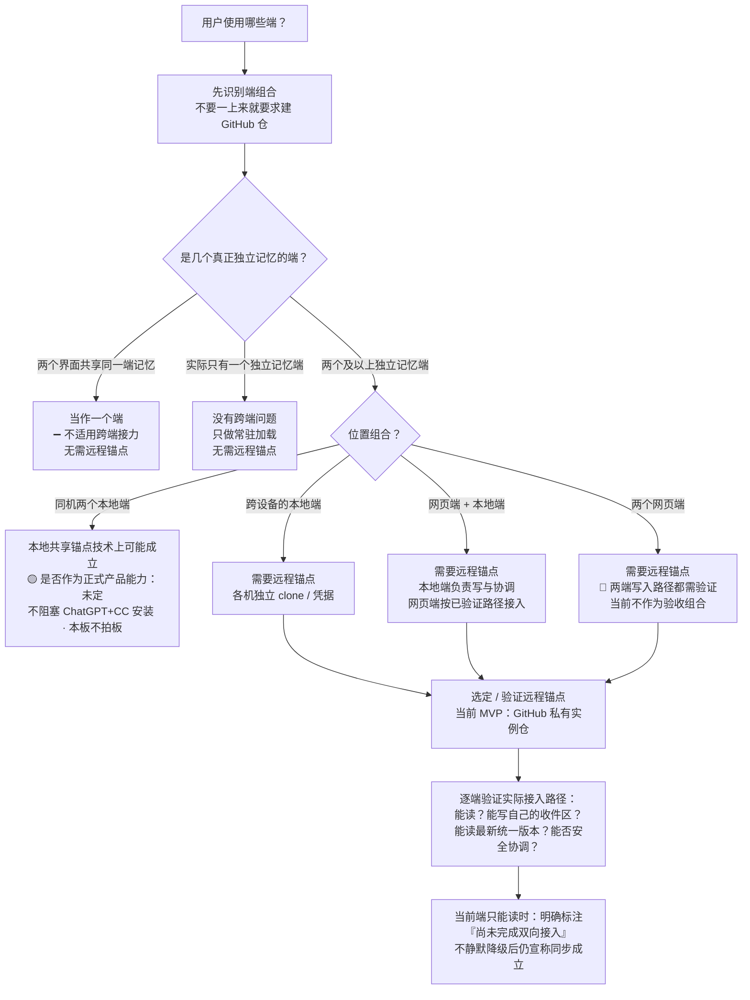

# 知界 · 安装前交互审查板（历史快照）

> [!IMPORTANT]
> 本文件冻结于 2026-08-13，记录审查基线 `0366ed7871e7cb6de7f0cf7f3d205728516cc99d` 下的 GitHub 多端自治协调方案。
> 动态任务已经迁移到 GitHub Project 与 Issues；2026-08-14 起，需求准备转向“Codex 唯一协调者 + 本地 Git 锚点 + 浏览器辅助线上端”。
> 本文件仅用于追溯旧架构的前提、问题与分界线，不再作为当前检查入口，也不再更新其中的 P / B / K 状态。

**以下内容保留当时原貌。** 当时它被设计为后续工作的唯一检查入口；这一职责后来由 GitHub Project 与 Issues 接管。

这份板子不扩写协议，也不触发安装。它只做一件事：把**已经确认的、尚未解决的、暂时搁置的**事情集中摆出来，让人逐项展开检查。

---

## 1. 顶部状态

| 项 | 当前 |
|---|---|
| **当前验收组合** | ChatGPT + Claude Code + **已有 GitHub 私仓** |
| **当前总状态** | 🔴 **尚未达到可安装验收** |
| **现在正在解决什么** | 无——本板刚建立，尚未开始逐项解决。建议第一项：`问题卡 P1`（Claude Code 安装命令纠正，硬阻塞、纯开发、可立即查证） |
| **当前安装阻塞项** | P1 安装命令 · P2 ChatGPT 稳定入口 · P4/P5 ChatGPT 倾倒与安全发布 · P6 已有私仓验证流程 · P8/P9/P10 跨端接力话术 · P14 三态回执（详见 [§9](#9-安装前阻塞清单)） |
| **用户下一步** | ①确认当前验收组合就是"ChatGPT + Claude Code + 已有私仓"；②从阻塞清单挑一项开始，一次一项 |
| **Agent 下一步** | 按查证顺序把**公开可查**的阻塞项查清（安装命令、ChatGPT 插件工具清单等），结论回填对应问题卡；**不改任何现有文件** |
| **明确暂缓** | Google Drive · Notion · Zed · Claude Desktop · 两个纯网页端组合 · 本地锚点是否正式支持 · hook 自动化 · 定时任务 · 营销文案（详见 [§10](#10-三个时间区)） |

**状态图标**（全板统一，不另造近义词）：

| 图标 | 含义 |
|---|---|
| ✅ | 已确认 |
| 🟡 | 部分确认 |
| 🔴 | 未解决 |
| ⏸️ | 暂缓 |
| 🚫 | 当前不支持 |
| ➖ | 不适用于当前场景 |

> 本板不使用完成百分比。进度靠逐项状态表达，不靠一个会撒谎的总分。

---

## 2. 怎么用这块板

- **一次只解决一个问题。** 从 [§9 阻塞清单](#9-安装前阻塞清单) 或 [§6 问题卡](#6-安装前问题卡) 里挑一张卡，解决后把它的"当前状态"和"下一步行动"更新掉。
- **卡片是可展开的。** 点问题卡的标题行展开细节，看完收起，避免一屏全是字。
- **两张 Mermaid 图是静态总览**，只看顶层路线，不能点、不能改状态、没有脚本交互。真正逐项检查在问题卡里。
- **发现现有文档还有问题** → 登记到 [§12 已知问题](#12-已知问题登记)，不在这里顺手修。

### 目录

- [1. 顶部状态](#1-顶部状态)
- [3. 用户第一次使用路线](#3-用户第一次使用路线)
- [4. Agent 接入判断路线](#4-agent-接入判断路线)
- [5. 场景地图](#5-场景地图)
- [6. 安装前问题卡](#6-安装前问题卡)
- [7. Claude 网页端事实边界](#7-claude-网页端事实边界)
- [8. ChatGPT 事实边界](#8-chatgpt-事实边界)
- [9. 安装前阻塞清单](#9-安装前阻塞清单)
- [10. 三个时间区](#10-三个时间区)
- [11. Agent 与用户的责任边界](#11-agent-与用户的责任边界)
- [12. 已知问题登记](#12-已知问题登记)

---

## 3. 用户第一次使用路线

这是用户实际经历的**前台流程**，不是后台数据结构。分支状态各自独立，不合并成一个"同步成功"节点。

**这张图故意保留的八种不同结局**（不许压成一个成功节点）：仓库验证失败 · 当前端只能读不能写 · 已提交但尚未被消费 · 基线端数量不足 · 当前端不能协调 · 发布失败 · 发布成功但第一端尚未加载 · 所有参与端已完成。

---

## 4. Agent 接入判断路线

Agent 先识别**端组合**，再决定是否需要远程锚点——**不是一上来就要求所有用户建 GitHub 仓**。

**同机两个本地端**单独说明：本地共享锚点在技术上可能成立（多个本地端共用一份 clone 可行，前提是不同时跑同步）；但**是否作为正式产品能力尚未决定**，这个问题**不阻塞**当前 ChatGPT + Claude Code 安装，本板**不擅自拍板**。见 `问题卡 P20`。

---

## 5. 场景地图

每个场景只回答八个问题。不展开 Git API 实现细节。

| 场景 | 需要远程锚点 | 第一次从哪里开始 | 用户怎样切换端 | 哪个端可提交倾倒 | 哪个端可协调 | 当前是否已支持 | 最大缺口 | 阻塞当前验收 |
|---|---|---|---|---|---|---|---|---|
| **ChatGPT + Claude Code，已有私仓** | 是 | 能写的本地端（Claude Code） | CC 倒完 → 切 ChatGPT，说"继续初始化知界" | CC ✅；ChatGPT 第一方插件（单文件已确认，多文件待查） | CC ✅（本地 git 全原语）；ChatGPT 协调资格待多文件安全发布确认 | 🟡 部分 | ChatGPT 稳定入口 + 多文件安全发布 + 跨端接力话术 | ✅ 是（这就是当前验收场景） |
| **ChatGPT + Claude Code，没有 GitHub** | 是 | 先由 Agent 引导建账号 + 私仓，再从 CC 起步 | 同上 | 同上 | 同上 | 🟡 部分 | 注册→授权→建私仓 引导流程完整性 | ✅ 是（通用初始化必须覆盖） |
| **同机两个本地端** | 不一定（本地共享锚点技术可行） | 任一本地端 | 同机切换，可共享一份 clone（整轮串行） | 两端都能 | 两端都能（有 git） | 🟡 部分 | 本地锚点是否纳入正式支持未拍板 | ➖ 否（不阻塞 ChatGPT+CC） |
| **跨设备的两个本地端** | 是 | 任一本地端 | 换设备，各机独立 clone | 两端都能 | 两端都能 | 🟡 部分 | 通道验证未逐端实跑 | ➖ 否 |
| **网页端 + 本地端** | 是 | 本地端（能写） | 本地倒完 → 切网页 | 本地 ✅；网页视已验证路径 | 本地端 | 🟡～🔴 取决于具体网页端 | 网页端写入路径 | ➖ 否（若恰为 ChatGPT+CC 则归第一行） |
| **两个网页端** | 是 | 需先有一个能安全写的端 | 待定 | 两端写入路径都需验证 | 需至少一端能安全发布 | 🔴 未解决 | 纯网页写入 + 协调路径 | ⏸️ 否（暂缓，见 §10） |
| **只有一个真正独立的记忆端** | ➖ 不需要 | 本端 | ➖ 无需切换 | ➖ 无跨端 | ➖ | ➖ 不适用（只做常驻加载） | — | ➖ 否 |
| **两个界面实际属于同一个端** | ➖ 不需要 | 本端 | ➖ | ➖ | ➖ | ➖ 不适用（当作一个端） | — | ➖ 否 |

---

## 6. 安装前问题卡

按真实依赖关系排列。编号 `P1…P21` 只是**阅读顺序 / 引用锚点**，不代表优先级评分。每张卡自带"是否阻塞"字段。

> 一次只展开并解决一张。

🔴 未解决｜P1 Claude Code 的正确安装路径与命令｜阻塞

- **当前状态**：🔴 未解决
- **用户问题还是开发问题**：开发问题
- **用户会看到什么**：README 给的一条 `git clone … ~/.claude/skills/contour`
- **用户需要做什么**：暂不执行；等命令被纠正后在自己机器验证一次
- **Agent 应自动完成**：核对 clone 目标是否会多套一层目录——技能真身在仓库的 `skills/contour/`，把整仓 clone 到 `~/.claude/skills/contour` 会让 `SKILL.md` 落到 `~/.claude/skills/contour/skills/contour/SKILL.md`；给出正确命令形态
- **通过标准**：干净环境执行给定命令后，`~/.claude/skills/contour/SKILL.md` 恰好存在、无多余层级，Claude Code 能识别该技能
- **当前证据**：已知问题登记（§12）"安装命令产生错误目录层级"；本仓布局 `skills/contour/SKILL.md`
- **尚未确认**：正确命令形态（clone 到临时目录再取子目录 / 调整仓库布局 / sparse checkout，三者取一）
- **下一步行动**：Agent 给出经过验证的安装命令，写进本卡；**暂不改 README**
- **行动负责人**：Agent（查证 + 设计）；用户（本机验证一次）
- **是否阻塞当前安装**：✅ 是（命令错，技能装不上）
- **关联文件位置**：`README.md` / `README.zh.md` 安装节、`skills/contour/SKILL.md`

🔴 未解决｜P2 ChatGPT 如何获得或调用知界的稳定入口｜阻塞

- **当前状态**：🔴 未解决
- **用户问题还是开发问题**：开发问题
- **用户会看到什么**：ChatGPT 里没有"技能"概念，说"初始化知界"时它未必知道该做什么
- **用户需要做什么**：暂不依赖 ChatGPT 独立发起；先在有技能的端（Claude Code）起步
- **Agent 应自动完成**：确定 ChatGPT 侧承载知界流程的稳定形态（自定义 GPT / 项目指令 / 固定引导 prompt / 第一方插件工作流），并登记候选
- **通过标准**：用户在 ChatGPT 说一句固定话，即可可靠进入知界倾倒 / 读取流程，不靠每次粘贴长 prompt
- **当前证据**：`docs/平台能力实测.md` 技能安装表——"ChatGPT 没有对应技能的概念 `[未验证]`"
- **尚未确认**：ChatGPT 侧稳定入口形态未定
- **下一步行动**：设计 ChatGPT 侧入口方案，登记候选
- **行动负责人**：Agent（设计）；用户（确认账号里能看到对应入口）
- **是否阻塞当前安装**：✅ 是
- **关联文件位置**：`docs/平台能力实测.md`、`skills/contour/SKILL.md`

🟡 部分确认｜P3 ChatGPT 第一方 GitHub 插件的准确名称和安装入口｜阻塞

- **当前状态**：🟡 部分确认
- **用户问题还是开发问题**：开发问题（公开可查证）
- **用户会看到什么**：设置里是否有该插件、叫什么
- **用户需要做什么**：登录后在 设置 → 插件 里确认能看到 GitHub 插件（属"账号里是否显示某入口"）
- **Agent 应自动完成**：给出准确入口路径与插件名，不让用户自己搜
- **通过标准**：写明"设置 → 插件 → GitHub"，Plus 可用、无需 Developer Mode，用户按此能找到
- **当前证据**：`docs/平台能力实测.md`——ChatGPT Plus 截图确认入口"设置 → 插件 → GitHub"，附带技能 Review Follow-up / CI Debug / GitHub / Publish Changes `[实测 2026-08-12]`
- **尚未确认**：不同区域 / 账号下的确切显示名是否一致
- **下一步行动**：以实测入口为准登记；用户在本人账号核对一次
- **行动负责人**：Agent（已基本查清）；用户（账号显示确认）
- **是否阻塞当前安装**：✅ 是（倾倒前提）
- **关联文件位置**：`docs/平台能力实测.md`

🟡 部分确认｜P4 ChatGPT 第一方插件当前暴露哪些仓库写工具｜阻塞

- **当前状态**：🟡 部分确认
- **用户问题还是开发问题**：开发问题（界面即可查证，**不需破坏性测试**）
- **用户会看到什么**：插件的工具清单
- **用户需要做什么**：在插件界面把工具清单**完整翻到底**（含 C 段 Create/Commit/Push 与 U 段），截图给 Agent
- **Agent 应自动完成**：据清单判定是否具备倾倒所需写工具；`Update file`（走 contents API、返回 commit SHA）已确认
- **通过标准**：确认存在至少单文件条件写入（已达成），并列出完整写工具清单
- **当前证据**：`docs/平台能力实测.md`——`Update file` 走 contents API、返回 commit SHA `[实测 2026-08-12]`；工具列表按字母序、截图停在 U 段
- **尚未确认**：`Update file` 参数是否显式暴露 `sha`；有无 Create/Commit/Push 段的多文件工具；`Publish Changes` 技能是什么
- **下一步行动**：用户补全清单截图 → Agent 判定
- **行动负责人**：Agent（判定）；用户（补截图，属"账号里显示什么"）
- **是否阻塞当前安装**：✅ 是
- **关联文件位置**：`docs/平台能力实测.md`

🔴 未解决｜P5 ChatGPT 是否存在符合安全发布要求的多文件单提交路径｜阻塞

- **当前状态**：🔴 未解决
- **用户问题还是开发问题**：开发问题（公开源码 + 界面清单可查，不需用户破坏性实测）
- **用户会看到什么**：一般看不到（内部能力）
- **用户需要做什么**：无（除非需在账号里确认某工具是否存在）
- **Agent 应自动完成**：确认 ChatGPT 侧能否一次提交改多个文件（发布必须原子）；若第一方插件不具备，评估 Developer Mode 挂 GitHub 官方 MCP（`push_files`）作为备用
- **通过标准**：存在一条"多文件落在同一 commit / 同一次 PR 合并"的路径，且能被过期基础版本拒绝
- **当前证据**：GitHub 官方 MCP `push_files` 已由源码确认——单次多文件提交、非强制 ref 更新 `[官方源码 2026-08-13]`（`repositories.go`）；ChatGPT 第一方插件是否有等价路径 `[未验证]`
- **尚未确认**：第一方插件的多文件原子提交能力；`Publish Changes` / 描述里的 "CLI fallbacks" 是否即此路径
- **下一步行动**：先查第一方插件清单（依赖 P4），不足再验证 Developer Mode + 官方 MCP
- **行动负责人**：Agent
- **是否阻塞当前安装**：✅ 是（决定 ChatGPT 协调资格）。注：只要 Claude Code 具协调资格，**当前验收可先由 CC 协调**，ChatGPT 作倾倒端——见 [§9](#9-安装前阻塞清单)
- **关联文件位置**：`docs/平台能力实测.md`、`skills/contour/references/protocol.md`（GH-04 / GH-06）

🔴 未解决｜P6 Claude Code 如何验证用户提供的已有私仓｜阻塞

- **当前状态**：🔴 未解决
- **用户问题还是开发问题**：开发问题
- **用户会看到什么**：第一次使用时被要求提供仓库地址，随后被告知验证结果
- **用户需要做什么**：提供已有专用私仓地址，并完成 OAuth 授权；**不被要求新建仓库**
- **Agent 应自动完成**：验证仓库私有、当前端有读写权限、目录结构合格；不合格则登记具体缺口并引导修复，而不是让用户另建
- **通过标准**：给定地址后，Agent 能明确回答"私有 ✓ / 权限 ✓ / 结构 ✓"或指出缺哪项；通过后直接进入基线倾倒
- **当前证据**：`assets/templates/config.md` 有"锚点 / 私有性确认 / 纳入端 / 接入状态"字段；`SKILL.md` 冷启动第 2 步要求"验证隐私、权限和目录结构后使用"
- **尚未确认**：验证的**具体步骤与判定清单**（读检查文件、探测写权限、校验目录）尚未成文为一条可执行流程
- **下一步行动**：把"已有私仓验证"写成一条明确检查流程（属设计，登记于此，不改现有文件）
- **行动负责人**：Agent（设计）；用户（提供地址、完成 OAuth）
- **是否阻塞当前安装**：✅ 是（当前验收场景第一步）
- **关联文件位置**：`skills/contour/SKILL.md` 冷启动第 2 步、`assets/templates/config.md`、`references/protocol.md`（GH-01 / GH-05）

🟡 部分确认｜P7 没有 GitHub 的用户如何完成账号、授权和私仓建立｜通用必需

- **当前状态**：🟡 部分确认
- **用户问题还是开发问题**：混合（流程设计 + 用户本人操作）
- **用户会看到什么**：从注册到建私仓的分步引导
- **用户需要做什么**：登录、验证码、服务条款、OAuth 授权（必须本人）
- **Agent 应自动完成**：获授权后创建私仓、设为私有、初始化目录；**不把这些甩回给用户手工**
- **通过标准**：无账号用户走完引导后，拥有一个私有、结构合格的专用实例仓，且未被要求手工建目录
- **当前证据**：`SKILL.md` / `新知界需求.md` 冷启动第 2 步已写"Agent 引导注册与授权，获权限后代为创建"
- **尚未确认**：Agent 在各端实际能否代建仓库（取决于该端 GitHub 工具是否有 create-repo 能力）
- **下一步行动**：登记为通用初始化必需路径；实际代建能力随 P4 / P5 工具清单一并确认
- **行动负责人**：Agent（引导 + 代建）；用户（登录 / 验证码 / 授权）
- **是否阻塞当前安装**：➖ 否（当前验收用户已有私仓）；但属**通用初始化必须覆盖**
- **关联文件位置**：`skills/contour/SKILL.md`、`docs/新知界需求.md` 冷启动协议

🔴 未解决｜P8 第一端完成倾倒后应给用户什么回执｜阻塞

- **当前状态**：🔴 未解决
- **用户问题还是开发问题**：开发问题（交互设计）
- **用户会看到什么**：一句"完成到哪一步"的回执
- **用户需要做什么**：读回执，据此切换端
- **Agent 应自动完成**：产出明确回执——已完成"第一端基线已提交"；统一版本尚未发布；你的内容尚未进入统一版本；下一步切到哪个端
- **通过标准**：回执让用户明确知道"已提交 ≠ 已进入统一版本"，并给出下一步端
- **当前证据**：`SKILL.md` 同步状态机第 3 步"失败留明确未提交状态，不许伪造成功"；已知问题（§12）"只能提交不能协调时回执没说明贡献尚未进入统一版本"
- **尚未确认**：回执的具体话术模板
- **下一步行动**：设计回执模板（成功 / 已提交未消费 / 失败 三态）
- **行动负责人**：Agent
- **是否阻塞当前安装**：✅ 是（跨端接力话术完整性）
- **关联文件位置**：`skills/contour/SKILL.md` 唯一同步状态机、`references/protocol.md` 消费 manifest

🔴 未解决｜P9 如何告诉用户切换到另一个端｜阻塞

- **当前状态**：🔴 未解决
- **用户问题还是开发问题**：开发问题（交互设计）
- **用户会看到什么**：切到哪个端 + 切过去后要说的**准确句子**
- **用户需要做什么**：照着切、照着说
- **Agent 应自动完成**：给出目标端名 + 一句可直接复述的话（让第二端识别为"继续初始化"）
- **通过标准**：用户无需自己组织语言，复述给定句子即可让第二端进入正确分支
- **当前证据**：`SKILL.md` 冷启动逐端倾倒，但未给跨端接力话术
- **尚未确认**：具体话术
- **下一步行动**：设计切换话术，与 P10 配套
- **行动负责人**：Agent
- **是否阻塞当前安装**：✅ 是
- **关联文件位置**：`skills/contour/SKILL.md`

🔴 未解决｜P10 第二端如何识别自己是在继续初始化而非重新初始化｜阻塞

- **当前状态**：🔴 未解决
- **用户问题还是开发问题**：开发问题
- **用户会看到什么**：第二端不再从头问一遍，而是接着已有进度
- **用户需要做什么**：说 P9 给定的切换句子
- **Agent 应自动完成**：第二端读实例仓 → 发现已有 config、已有第一端基线、尚未达两端门槛 → 判定为"新端接入 / 继续初始化"，直接跑本端基线倾倒
- **通过标准**：第二端不重复建仓、不重问全部冷启动问题、不覆盖第一端进度
- **当前证据**：`SKILL.md`"判断用户在哪一步"表——"`state/endpoints/` 里没有这一端 → 新端接入"；状态从实例仓推
- **尚未确认**：第二端在网页端（ChatGPT）能否稳定读到实例仓状态以做此判断（依赖 P2 / P4）
- **下一步行动**：设计基于实例仓状态的"继续初始化"识别流程
- **行动负责人**：Agent
- **是否阻塞当前安装**：✅ 是
- **关联文件位置**：`skills/contour/SKILL.md`、`references/protocol.md`、`assets/templates/config.md` 初始化状态字段

🟡 部分确认｜P11 第二端发布统一版本后是否必须返回第一端｜阻塞

- **当前状态**：🟡 部分确认
- **用户问题还是开发问题**：开发问题
- **用户会看到什么**：被告知"是否需要回到第一端加载新版本"
- **用户需要做什么**：按提示决定是否切回
- **Agent 应自动完成**：判断第一端是否已加载最新统一版本；未加载则提示切回加载，并分别记录各端读到的版本
- **通过标准**：能区分"仓库已发布"与"第一端已加载"，只在未加载时要求返回
- **当前证据**：`新知界需求.md`——"统一锚点发布、端侧副本追平、当前上下文加载、原生记忆吸收是四个应分别记录的状态"；同步状态机第 7 步"让当前端读取 routing.md"
- **尚未确认**：网页第一端的"已加载"如何被证明（依赖 P12 / P13）
- **下一步行动**：把"发布后加载判断"纳入回执与状态记录
- **行动负责人**：Agent
- **是否阻塞当前安装**：✅ 是（加载闭环——只发布不喂，收敛不成立）
- **关联文件位置**：`docs/新知界需求.md`、`skills/contour/SKILL.md`、`references/load.md`

🟡 部分确认｜P12 怎样证明两个端实际读到了哪个统一版本｜阻塞

- **当前状态**：🟡 部分确认
- **用户问题还是开发问题**：开发问题（含黑盒观察）
- **用户会看到什么**：每个端分别标注"读到 vN"
- **用户需要做什么**：黑盒记忆是否吸收，由用户观察确认
- **Agent 应自动完成**：让每端记录"最后读到的统一版本"；用可核对的版本标记验证读回
- **通过标准**：能对每个端给出"已读到具体版本号"，而非笼统"已同步"
- **当前证据**：`protocol.md` 倾倒包 frontmatter 有 `last_contour_revision_read`；GH-01 回读验证；`state/endpoints/<id>.md` 记游标
- **尚未确认**：GH-01～03 未在任何端实跑；网页端确定性读回未验证
- **下一步行动**：逐端跑 GH-01～03（工具清单能答一半）
- **行动负责人**：Agent（设计 + 可查部分）；用户（账号内读回确认）
- **是否阻塞当前安装**：✅ 是（验收标准"参与端读到同一版本"）
- **关联文件位置**：`references/protocol.md` 端标识 / 倾倒包、`docs/平台能力实测.md` 待验证清单

🟡 部分确认｜P13 怎样区分"已发布/副本已更新/已加载/原生已吸收"四态｜阻塞

- **当前状态**：🟡 部分确认
- **用户问题还是开发问题**：开发问题（含黑盒观察）
- **用户会看到什么**：回执分别标注这四件事，而不是一个笼统"同步成功"
- **用户需要做什么**：确认平台原生记忆是否真的吸收（黑盒，需本人观察 / 新会话验证）
- **Agent 应自动完成**：分别记录并报告四态——①仓库已发布 ②端副本已更新 ③当前对话已加载 ④原生记忆已吸收；不把它们压成一个成功节点
- **通过标准**：任一时刻能分别回答这四件事的状态
- **当前证据**：`新知界需求.md` 明确"四个应分别记录的状态"；已知问题（§12）"四态尚未分别记录"；`SKILL.md`"模型口头说记住了不算验证，要开新会话看还在不在"
- **尚未确认**：网页端原生记忆吸收的可观察性
- **下一步行动**：把四态写进回执与 `state/endpoints/` 记录规范（设计，登记于此）
- **行动负责人**：Agent（记录设计）；用户（原生吸收确认）
- **是否阻塞当前安装**：✅ 是（回执准确性）
- **关联文件位置**：`docs/新知界需求.md`、`references/protocol.md`、`references/load.md`、`references/probe.md`

🔴 未解决｜P14 初始化成功、部分完成和失败分别如何表述｜阻塞

- **当前状态**：🔴 未解决
- **用户问题还是开发问题**：开发问题
- **用户会看到什么**：三种明确不同的回执
- **用户需要做什么**：据回执知道下一步
- **Agent 应自动完成**：区分"冷启动完成 / 暂定版本（部分）/ 失败或未达门槛"，各给明确措辞
- **通过标准**：三态措辞互不混淆；"暂定版本"必须明说"尚未实现跨端一致"
- **当前证据**：`SKILL.md` 冷启动验收清单分"最小可用 / 冷启动完成"两档；"还有端没倒时产出的是暂定版本，要明确告诉用户还没实现跨端一致"
- **尚未确认**：三态的最终话术模板
- **下一步行动**：设计三态回执模板
- **行动负责人**：Agent
- **是否阻塞当前安装**：✅ 是
- **关联文件位置**：`skills/contour/SKILL.md` 冷启动验收清单、`assets/templates/config.md` 初始化状态

🟡 部分确认｜P15 日常只有 ChatGPT 出现新增内容时的完整流程｜设计前置

- **当前状态**：🟡 部分确认
- **用户问题还是开发问题**：开发问题
- **用户会看到什么**：在 ChatGPT 说"同步知界"后的完整走向
- **用户需要做什么**：说一句话触发
- **Agent 应自动完成**：ChatGPT 先保护本端增量（生成 incremental）→ 提交收件区 → 能协调则合并发布，否则留待其他端协调 → 回执
- **通过标准**：单端有新增即可触发一版发布（首版之后不需第二端同时倾倒）；无协调资格时明确告知"已提交待协调"
- **当前证据**：`SKILL.md` 同步状态机；"第一版建立后，日常只有一个端交 incremental 也可以立刻合并"
- **尚未确认**：ChatGPT 协调资格（依赖 P5）；ChatGPT 稳定入口（依赖 P2）
- **下一步行动**：待 P2 / P5 明确后定稿该流程
- **行动负责人**：Agent
- **是否阻塞当前安装**：➖ 否（属首次验收后日常；但需在真实安装前设计清楚）
- **关联文件位置**：`skills/contour/SKILL.md`、`references/protocol.md`

🟡 部分确认｜P16 日常只有 Claude Code 出现新增内容时的完整流程｜设计前置

- **当前状态**：🟡 部分确认
- **用户问题还是开发问题**：开发问题
- **用户会看到什么**：在 Claude Code 说"同步知界"后的完整走向
- **用户需要做什么**：说一句话触发
- **Agent 应自动完成**：CC 先保护本端增量 → 提交 → 因具协调资格，直接合并发布（基础版本检查）→ 回执 → 喂原生记忆
- **通过标准**：单端新增即触发一版发布；发布走原子提交 + 基础版本检查
- **当前证据**：CC 有本地 git 与完整原语，具协调资格；`push_files` 源码已确认非强制 ref 更新 `[官方源码 2026-08-13]`
- **尚未确认**：GH-04 / GH-06 在 CC 实跑（源码已确认公开语义，剩回归确认）
- **下一步行动**：在最终选定适配器上做一次回归确认
- **行动负责人**：Agent
- **是否阻塞当前安装**：➖ 否（首次验收后日常；需在真实安装前设计清楚）
- **关联文件位置**：`skills/contour/SKILL.md`、`references/protocol.md`

🔴 未解决｜P17 本端倾倒包已提交但尚未被消费时必须怎样告诉用户｜阻塞

- **当前状态**：🔴 未解决
- **用户问题还是开发问题**：开发问题
- **用户会看到什么**：一句"你的内容已提交，但还没进入统一版本"
- **用户需要做什么**：知道自己的贡献处于"待协调"，不误以为已同步
- **Agent 应自动完成**：检测本端包在候选集（未进消费 manifest）→ 回执明说未消费
- **通过标准**：不把"已提交"说成"已同步 / 已进入统一版本"
- **当前证据**：已知问题（§12）登记；`protocol.md` 消费 manifest 三态（未列出 / 消费 / 拒绝）
- **尚未确认**：与 P8 / P14 合并成一套回执措辞
- **下一步行动**：并入回执模板设计
- **行动负责人**：Agent
- **是否阻塞当前安装**：✅ 是（回执完整性）
- **关联文件位置**：`references/protocol.md` 消费 manifest、`skills/contour/SKILL.md`

🟡 部分确认｜P18 没有新增内容时怎样避免空包和无意义版本｜设计前置

- **当前状态**：🟡 部分确认
- **用户问题还是开发问题**：开发问题
- **用户会看到什么**：说"同步知界"但没新增时，被告知"无变化，未创建新包"
- **用户需要做什么**：无
- **Agent 应自动完成**：判定无变化 → 不建包、不发版本
- **通过标准**：无变化时零新增文件、零新版本；判定标准唯一、不自相矛盾
- **当前证据**：`SKILL.md` 状态机第 2 步"没有变化就不创建包"；已知问题（§12）"无变化判定标准互相矛盾，可能重复生成增量包"
- **尚未确认**：统一的"无变化"判定标准（现有多处表述可能冲突，登记待统一）
- **下一步行动**：统一"无变化"判定标准（登记冲突，不在此修复）
- **行动负责人**：Agent
- **是否阻塞当前安装**：➖ 否
- **关联文件位置**：`skills/contour/SKILL.md`、`references/dump.md`、`references/protocol.md`

🟡 部分确认｜P19 用户怎样随时查看当前进行到哪一步｜设计前置

- **当前状态**：🟡 部分确认
- **用户问题还是开发问题**：开发问题
- **用户会看到什么**：说"看下知界状态"后的一页概览
- **用户需要做什么**：说一句话
- **Agent 应自动完成**：读实例仓 config / state / manifest → 报告处在冷启动 / 追平 / 整合 / 倾倒 / 体检哪一步
- **通过标准**：不需用户交代上下文即可给出当前步骤
- **当前证据**：`SKILL.md`"判断用户在哪一步"从实例仓推
- **尚未确认**：网页端能否稳定读到实例仓状态（依赖 P10 / P12）
- **下一步行动**：定义状态概览的输出格式
- **行动负责人**：Agent
- **是否阻塞当前安装**：➖ 否
- **关联文件位置**：`skills/contour/SKILL.md`、`assets/templates/config.md`

⏸️ 暂缓｜P20 同机两个本地端是否正式支持本地锚点｜不阻塞

- **当前状态**：⏸️ 暂缓
- **用户问题还是开发问题**：产品决策问题
- **用户会看到什么**：当前验收不涉及
- **用户需要做什么**：无
- **Agent 应自动完成**：登记"技术上可能成立"，但**不拍板**是否作为正式产品能力
- **通过标准**：—（暂缓项，无当前通过标准）
- **当前证据**：`docs/平台能力实测.md` 四——"多个本地端共用一份 clone 可以，前提是不同时跑同步"
- **尚未确认**：是否纳入正式支持
- **下一步行动**：搁置；出现"两个本地端且无远程锚点"的真实需求时重开
- **行动负责人**：用户（产品决策）
- **是否阻塞当前安装**：➖ 否
- **关联文件位置**：`docs/平台能力实测.md` 第四节

🔴 未解决｜P21 当前 README 是否足够让陌生用户完成安装和首次使用｜内容阻塞·修复暂缓

- **当前状态**：🔴 未解决（内容不足；正式改写属验收后）
- **用户问题还是开发问题**：开发问题
- **用户会看到什么**：README 里"目前还装不了"与"怎么装"并存、安装命令、滞后的分支提醒
- **用户需要做什么**：暂不以现有 README 自助执行安装；当前验收走 Agent 引导
- **Agent 应自动完成**：登记 README 内部冲突（见 §12），但按边界"**只登记不修复**"
- **通过标准**：README 能自洽地让陌生人走完安装 + 首次使用（含跨端接力），且与本板结论一致
- **当前证据**：已知问题（§12）——README 自相矛盾 / 安装命令目录层级 / 默认分支旧产品且提醒滞后 / 未完整展示首次跨端接力
- **尚未确认**：README 重写在验收完成后进行
- **下一步行动**：仅登记；README 正式改写放入 [§10 验收后再做](#10-三个时间区)
- **行动负责人**：Agent（验收后）；用户（最终审阅）
- **是否阻塞当前安装**：🟡 对**完全靠 README 自助的陌生用户**阻塞；对**有 Agent 引导的当前验收用户**不硬阻塞。修复动作暂缓到验收后
- **关联文件位置**：`README.md`、`README.zh.md`

---

## 7. Claude 网页端事实边界

**不能再把所有 Claude 网页界面统称为一个端。** 按界面拆开：

### Claude.ai Chat / Projects

- 内置 GitHub 负责**读取和同步**仓库文件。✅
- 当前接入方式**不能向仓库提交倾倒包**。🚫
- 普通 Chat 的临时代码环境当前实测**可以改文件并执行本地 commit**。🟡
- 该临时环境**没有** GitHub token、SSH key 或 credential helper。
- `git push` **实测失败**（`fatal: could not read Username for 'https://github.com'`）。🚫
- 临时环境中的本地 commit **不等于**远端仓库已更新。

### 左侧 Code 标签

- Code 标签属于 **Claude Code 会话体系**。
- 用户当前看到的是本地 Claude Code 会话的**远程映射**。
- Code 标签里的会话、文件能力和 GitHub 权限属于**背后的 Claude Code 环境**。
- Claude Code 的记忆**不与** Claude.ai Chat 的原生记忆同步。
- Code 能写 GitHub，**不能证明** Claude.ai Chat 能写。
- Code **不能替代** Claude.ai Chat 倾倒 Chat 自己的记忆。

### 远程 MCP

- Claude.ai 平台**理论上允许**远程 MCP 暴露写工具。✅（平台事实）
- GitHub 官方 MCP 提供仓库写工具。✅
- 但 GitHub 官方远程 MCP 在**当前 claude.ai Chat 账号**中的 OAuth、工具暴露和私仓权限**尚未验证**。🟡
- 因此只能登记为**候选路径**，不能写成已经支持，也不能反过来写成永远不支持。

> 证据：`docs/平台能力实测.md` 二"claude.ai 必须按界面拆开"表 + "Chat 的写入资格取决于实际接入路径"表 `[实测 + 官方文档 2026-08-13]`。

---

## 8. ChatGPT 事实边界

**不使用模糊的"GitHub 集成"。** 三条路径必须分开：

### ChatGPT GitHub 连接器（Connector）

- 用于**索引和检索**仓库。
- 是**只读**通道。🚫（写）
- 不能因为它能读仓库就认为 ChatGPT 已完成双向接入。

### ChatGPT 第一方 GitHub 插件（Plugin）

- 用户的 **Plus 账号已确认存在**。✅
- 入口是**设置 → 插件 → GitHub**。
- 已确认**具备仓库写能力**。✅
- 已确认至少存在**单文件写工具**（`Update file`，contents API，返回 commit SHA）。✅
- **不得**重新标记成"ChatGPT 只能只读"。
- 仍需整理：实际写工具完整清单，以及是否存在符合安全发布条件的**多文件路径**（见 P4 / P5）。🟡

### GitHub MCP

- 这是**另一种**工具接入路径，不得与第一方插件或只读连接器混称。
- `push_files` 的公开源码已确认：创建**单个多文件提交**，使用**非强制 ref 更新**。✅ `[官方源码 2026-08-13]`
- 这类公开实现事实**不需要**再让用户搜索或通过破坏性测试发现。
- 当前产品是否**实际接入**该 MCP，是另一件事，必须分开记录。🟡

> 证据：`docs/平台能力实测.md` 二"ChatGPT 里有两个 GitHub 集成""第一方 GitHub 插件"与"`push_files` 源码"三节。

---

## 9. 安装前阻塞清单

只放会**真正阻止当前用户安装 ChatGPT + Claude Code** 的事项。每项都有明确通过标准，不写"需要测试"。

| # | 阻塞项 | 通过标准 | 状态 | 卡片 |
|---|---|---|---|---|
| B1 | Claude Code 安装命令是否正确 | 干净环境执行给定命令后 `~/.claude/skills/contour/SKILL.md` 恰好存在、无多余层级，且被识别 | 🔴 | P1 |
| B2 | ChatGPT 是否有稳定的知界调用入口 | 用户说一句固定话即可可靠进入知界流程，不靠每次粘长 prompt | 🔴 | P2 |
| B3 | ChatGPT 第一方插件能否完成倾倒包提交 | 能把一份倾倒文件写进 `dumps/inbox/chatgpt-web/` 并取得可回查的提交标识 | 🟡 | P3 / P4 |
| B4 | 至少一个端具备**已确认**的安全协调路径 | 该端能一次提交多文件、且过期基础版本被拒——Claude Code 满足（`push_files` 语义源码已确认，剩回归确认） | 🟡 | P5 / P16 |
| B5 | 第一次跨端接力话术是否完整 | 存在"切到哪个端 + 切后说什么 + 第二端识别为继续初始化"的完整话术 | 🔴 | P8 / P9 / P10 |
| B6 | 成功、部分完成、失败回执是否完整 | 三态措辞互不混淆，"暂定版本"明说尚未跨端一致，"已提交未消费"明说未进统一版本 | 🔴 | P8 / P14 / P17 |
| B7 | 用户已有私仓的验证流程是否完整 | 给定地址后能明确判定"私有 / 权限 / 结构"三项并进入基线倾倒 | 🔴 | P6 |

> **B4 的现实含义**：当前验收组合里 **Claude Code 就是那个"已确认安全协调路径"的端**，ChatGPT 即便暂时只能倾倒也不阻断——由 CC 协调发布即可。所以 B4 的通过不依赖 ChatGPT 多文件路径（P5）先落地；P5 决定的是 ChatGPT **能否也当协调者**，属增强，不属当前验收阻塞的必要条件。

---

## 10. 三个时间区

### 现在必须解决

只放阻塞 ChatGPT + Claude Code 首次安装的事项：**P1 · P2 · P3 · P4 · P5 · P6 · P8 · P9 · P10 · P11 · P12 · P13 · P14 · P17**（对应阻塞清单 B1–B7）。

配套需在真实安装前设计清楚的日常交互：**P15 · P16 · P18 · P19**（不硬阻塞安装动作，但属"进行真实安装前"要落定的设计）。

### 当前验收完成后再做

- 正式改写 README（P21）
- 正式修改技能交互
- 正式修正协议
- 根据审查结果**统一平台术语**
- 设计公开发布的**支持矩阵**

### 以后再看

每项写明：为什么现在不处理 · 它不阻塞什么 · 什么条件出现后重新打开。**暂缓不等于删除。**

| 暂缓项 | 为什么现在不处理 | 不阻塞什么 | 重新打开的条件 |
|---|---|---|---|
| Google Drive | MVP 只支持 GitHub；Plus 的 Drive 连接器能力受限且未验证 | 不阻塞 ChatGPT+CC | 有用户主力端已验证可读写 Drive，且提出真实需求 |
| Notion | 条件写入 / 事务语义未查到、未验证 | 不阻塞当前锚点（GitHub） | 决定评估 Notion 作锚点，且能实跑并发写入验证 |
| Zed | 不在当前验收端内 | 不阻塞 ChatGPT+CC | 用户把 Zed 纳入主力端 |
| Claude Desktop | 登 claude.ai 账号、常驻加载未验证 | 不阻塞当前组合 | 用户纳入且完成常驻加载验证 |
| 两个纯网页端组合 | 纯网页写入路径未验证（见 §7 / §8） | 不阻塞含本地端的组合 | 至少一个网页端写入路径被验证可写 |
| 本地锚点是否正式支持（P20） | 技术可行但产品定位未定 | 不阻塞远程锚点路径 | 出现"两个本地端且无远程锚点"的真实需求 |
| hook 自动化 | 会话结束钩子预算（1–3 秒）扛不动网络提交 | 不阻塞手动触发同步 | 找到不依赖钩子预算的可靠自动化路径 |
| 定时任务 | MVP 不做定时倾倒，避免空包与并发 | 不阻塞用户主动同步 | 用户主动开启且并发/空包问题已解决 |
| 营销文案润色 | 与能否安装无关 | 不阻塞任何技术项 | 产品达到可安装验收后 |

---

## 11. Agent 与用户的责任边界

**凡是公开可查的问题，必须由 Agent 先查，不能直接登记成"待用户实测"。**

**查证顺序**：官方文档 → 官方源码 → 当前工具列表 / 界面信息 → 仍无法确认时，才设计**最小、无破坏性**的当前账号验证。

**结论必须区分这六档，"没查到"不得写成"不支持"**：

| 档位 | 含义 |
|---|---|
| 已确认支持 | 官方明写或实跑通过 |
| 已确认不支持 | 官方明写"不支持"或实跑被拒 |
| 官方未说明 | 文档没提这个能力 |
| 没查到 | 搜过没搜到——**不等于不支持** |
| 当前账号未验证 | 能力可能存在，但本账号没跑过 |
| 当前接入路径尚未安装 | 工具/插件/MCP 还没接上 |

**用户只负责**（黑盒、必须本人）：登录 · 验证码 · OAuth 授权确认 · 当前账号是否显示某入口 · 私仓是否对当前账号可见 · 平台原生记忆是否真正吸收 · 其他无法从公开材料确认的黑盒行为。

**不得让用户负责**：搜索 GitHub API · 阅读公开源码 · 判断工具的事务 / 并发语义 · 搜索产品公开支持范围 · 自己设计技术测试 · 手工完成 Agent 已获权限可执行的仓库操作。

---

## 12. 已知问题登记

以下问题已由评审发现，**直接登记，不重新发现一遍**。此处只登记，不在本板顺手修。

| # | 问题 | 状态 | 是否阻塞当前安装 | 关联卡 / 位置 |
|---|---|---|---|---|
| K1 | README 同时说"目前不能安装"又提供安装流程 | 🔴 | 是（入口自洽） | P21 · `README*.md` |
| K2 | Claude Code 当前安装命令会产生错误目录层级 | 🔴 | 是 | P1 · `README*.md` |
| K3 | 默认分支仍是旧产品，分支提醒放在安装命令之后 | 🔴 | 是 | P1 / P21 · `README*.md` |
| K4 | README 没有完整展示第一次跨端接力 | 🟡 | 是（话术完整性） | P8 / P9 / P10 / P21 |
| K5 | 状态判断把可同时成立的状态写成互斥分支，可能破坏"先倾倒、后读取" | 🔴 | 是 | P11 / P13 · `SKILL.md` 同步状态机 |
| K6 | 无变化判定标准互相矛盾，可能重复生成增量包 | 🟡 | 否 | P18 · `SKILL.md` / `dump.md` |
| K7 | inbox 唯一文件名只能防文件覆盖，不能消除 Git 分支并发冲突 | 🟡 | 否（协议约束层面） | `protocol.md` 发布 / 并发节 |
| K8 | **GH-04 在协议中存在两套定义** | 🟡 | 否（术语一致性） | `references/protocol.md` L268（四原语）↔ L319 表（读/搜/提交/更文/PR/合并 + 多文件）· 关 P5 |
| K9 | 发布路径的替代方案没有全部定义相同的基础版本保护 | 🟡 | 否 | `assets/templates/config.md` 三选一发布路径 · `protocol.md` |
| K10 | "仓库已发布 / 端副本已更新 / 当前对话已加载 / 原生记忆已吸收"尚未分别记录 | 🟡 | 是（回执准确性） | P13 · `新知界需求.md` |
| K11 | 当前端只能提交不能协调时，回执没说明本次贡献尚未进入统一版本 | 🔴 | 是 | P8 / P17 |
| K12 | 同机共享工作目录只有在整轮串行时才安全 | 🟡 | 否 | P20 · `平台能力实测.md` 四 |
| K13 | ChatGPT 可写插件已确认，但插件 / 只读连接器 / MCP 的结论仍分散 | 🟡 | 否（本板已集中，见 §8） | P3 / P4 / P5 · §8 |
| K14 | Claude.ai Chat / Projects / Code 标签 / 临时代码环境曾被混称为"claude.ai 网页端" | 🟡 | 否（本板已拆开，见 §7） | §7 |
| K15 | Code 标签中的 Claude Code 记忆曾被错误当成 Claude.ai Chat 记忆 | 🟡 | 否（本板已澄清，见 §7） | §7 |
| K16 | 纯网页组合曾在写入路径未验证时被提前宣称成立 | 🟡 | 否（场景 6 已标未验证） | §5 场景 6 · §7 / §8 |
| K17 | 初始化曾无条件要求新建仓库，未考虑已有专用私仓及无 GitHub 账号的用户 | 🟡 | 否（本板 §3 / P6 / P7 已覆盖三类用户） | P6 / P7 · §3 |

> 说明：K13–K17 在最新文档与本板中已按最新结论集中或拆分，登记于此是**防回退**——后续任何改动若又把它们混回去，以本条为准回滚认知。

---

历史规则：本板当时只登记与组织，不修改任何现有文件、不连接账号、不提交。该工作方式现已退役。
